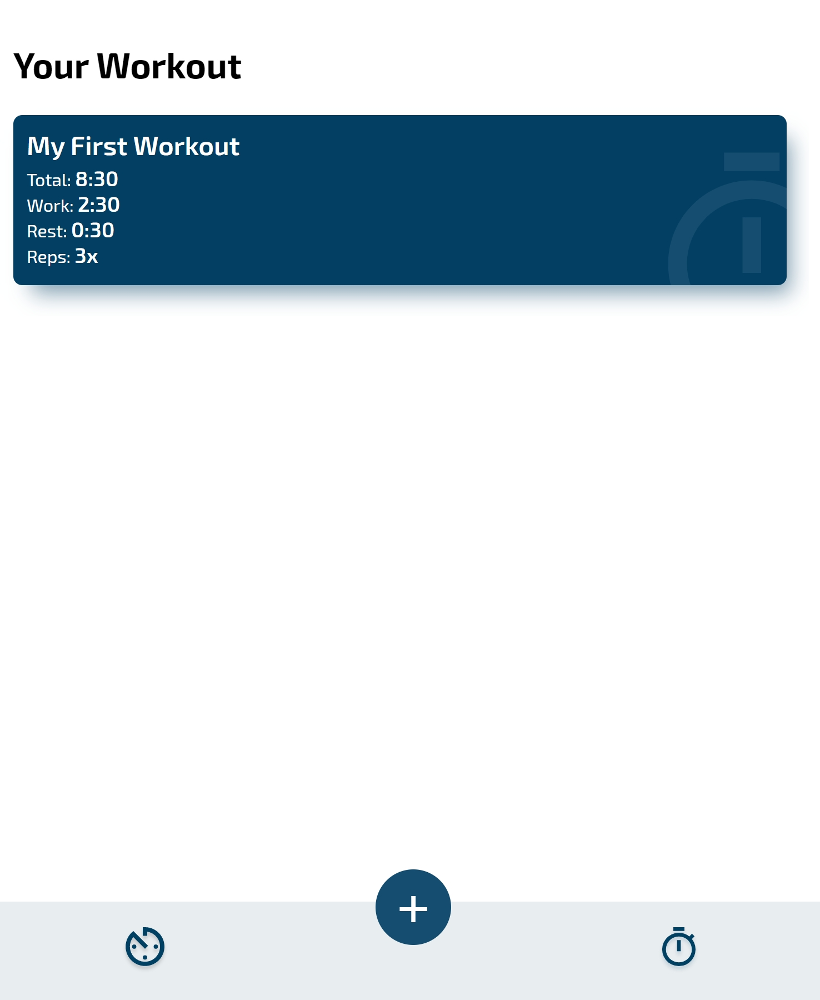
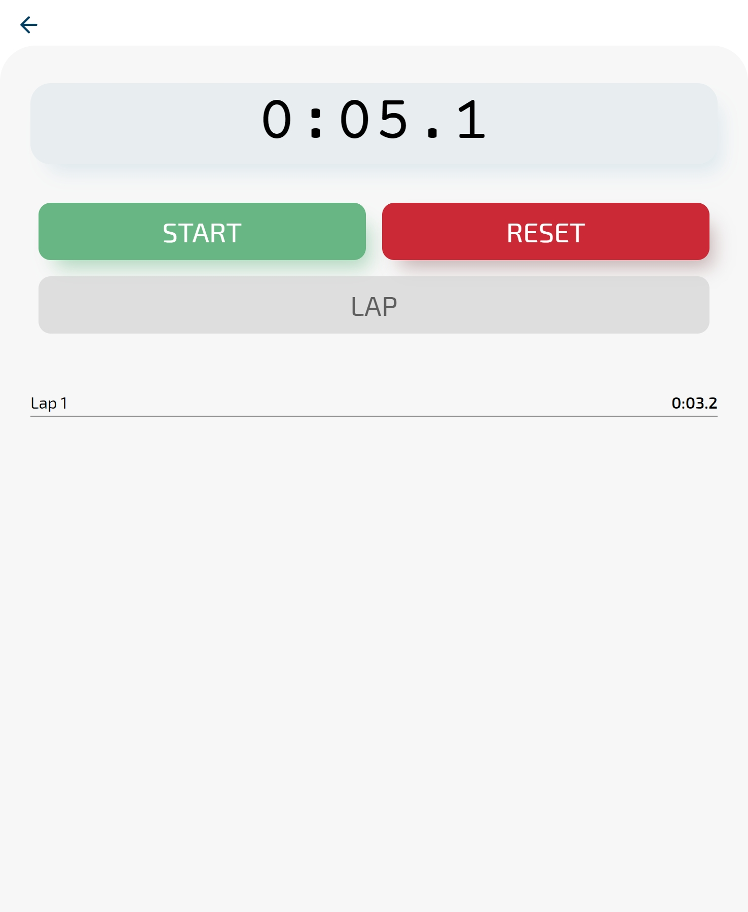
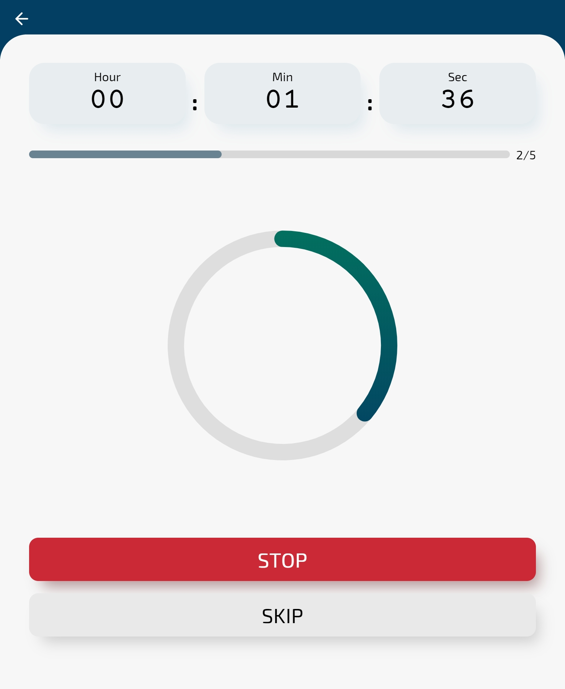
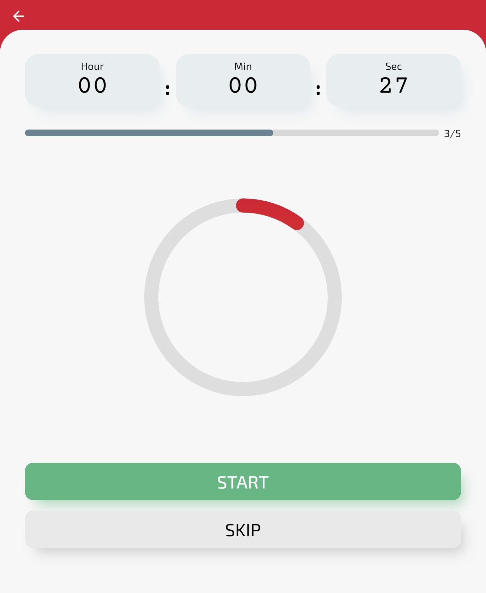

# timer-web

A HIIT timer where you can set the work time, the rest time and how many repetition you want to do. The application include also a timer and a stopwatch

---

[Demo](https://lorenzo-mignola.github.io/hiit-timer/)

---

---

## TODO

- [ ] snackbar on error
- [ ] responsive
- [ ] pwa offline
